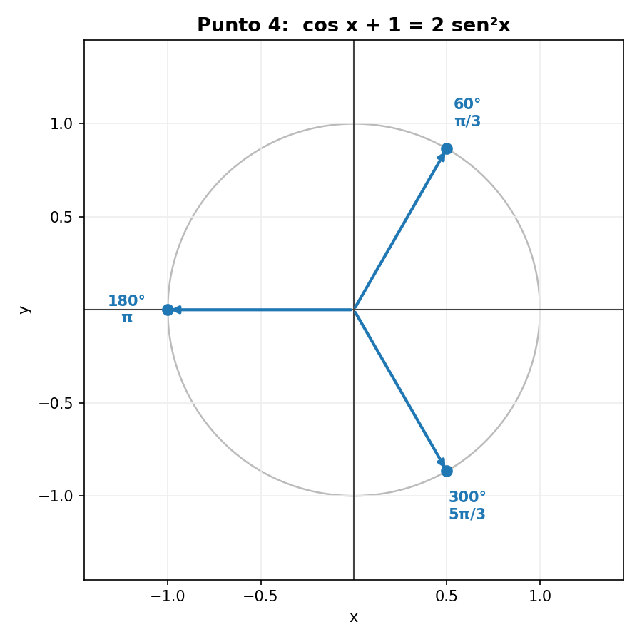
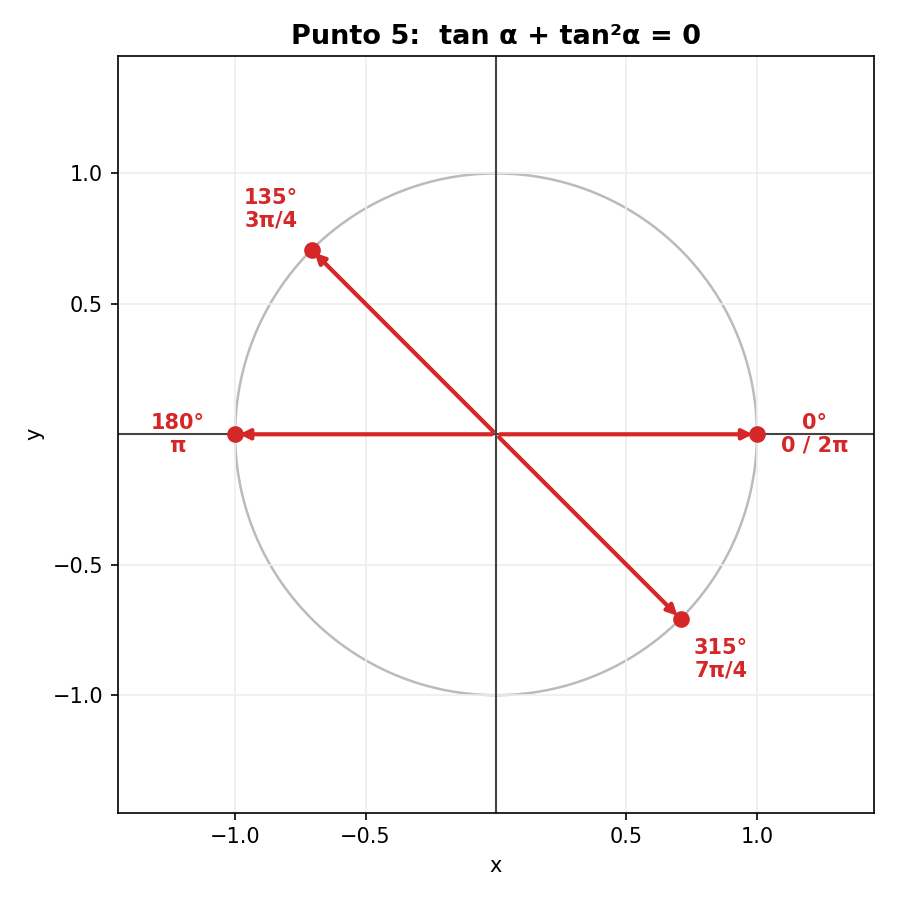

# Taller #1: Trigonometría Analítica — Soluciones paso a paso

> Documento de apoyo para estudiantes de **primer semestre de ingeniería**.
> Para el enunciado original ver [Taller_01_Trigonometria_Analitica.md](Taller_01_Trigonometria_Analitica.md).

## Identidades y conceptos que se usan en todo el taller

Antes de empezar, conviene tener a la mano estas herramientas básicas (válidas para
todo ángulo, salvo donde un denominador se anule):

**Definiciones (funciones recíprocas y cocientes):**

$$\csc x = \frac{1}{\operatorname{sen} x}, \qquad \sec x = \frac{1}{\cos x}, \qquad \cot x = \frac{1}{\tan x} = \frac{\cos x}{\operatorname{sen} x}$$

$$\tan x = \frac{\operatorname{sen} x}{\cos x}$$

**Identidad pitagórica fundamental** (y sus despejes):

$$\operatorname{sen}^2 x + \cos^2 x = 1 \;\Longrightarrow\; \operatorname{sen}^2 x = 1 - \cos^2 x, \quad \cos^2 x = 1 - \operatorname{sen}^2 x$$

**Diferencia de cuadrados** (álgebra, no trigonometría):

$$a^2 - b^2 = (a - b)(a + b)$$

> Nota de notación: en el enunciado se usa $\operatorname{sen}$ (español) y
> $\operatorname{ctg} x = \cot x$. Aquí mantenemos esa notación.

---

# Puntos 1 al 3: Demostración de identidades

**Estrategia general para demostrar una identidad:** se toma **uno** de los lados
(normalmente el más complicado) y se transforma con álgebra e identidades hasta
llegar al otro lado. No se debe "pasar términos" como si fuera una ecuación, porque
eso supondría que la igualdad ya es cierta.

---

## Punto 1

$$1 + \frac{\operatorname{sen} x \cdot \cot^2 x}{1 + \operatorname{sen} x} = \csc x$$

### Conocimientos previos necesarios
- Definición de $\cot x = \dfrac{\cos x}{\operatorname{sen} x}$ y de $\csc x = \dfrac{1}{\operatorname{sen} x}$.
- Identidad pitagórica $\cos^2 x = 1 - \operatorname{sen}^2 x$.
- Factorización por **diferencia de cuadrados**: $1 - \operatorname{sen}^2 x = (1 - \operatorname{sen} x)(1 + \operatorname{sen} x)$.
- Suma de fracciones con común denominador y simplificación de factores comunes.

### Desarrollo (trabajamos el lado izquierdo)

**Paso 1.** Escribimos $\cot^2 x$ en términos de seno y coseno:

$$\operatorname{sen} x \cdot \cot^2 x = \operatorname{sen} x \cdot \frac{\cos^2 x}{\operatorname{sen}^2 x} = \frac{\cos^2 x}{\operatorname{sen} x}$$

**Paso 2.** Sustituimos en la fracción y usamos $\cos^2 x = 1 - \operatorname{sen}^2 x$:

$$\frac{\operatorname{sen} x \cdot \cot^2 x}{1 + \operatorname{sen} x} = \frac{\cos^2 x}{\operatorname{sen} x\,(1 + \operatorname{sen} x)} = \frac{1 - \operatorname{sen}^2 x}{\operatorname{sen} x\,(1 + \operatorname{sen} x)}$$

**Paso 3.** Factorizamos por diferencia de cuadrados y cancelamos $(1+\operatorname{sen} x)$:

$$= \frac{(1 - \operatorname{sen} x)(1 + \operatorname{sen} x)}{\operatorname{sen} x\,(1 + \operatorname{sen} x)} = \frac{1 - \operatorname{sen} x}{\operatorname{sen} x}$$

**Paso 4.** Sumamos el $1$ del inicio (común denominador $\operatorname{sen} x$):

$$1 + \frac{1 - \operatorname{sen} x}{\operatorname{sen} x} = \frac{\operatorname{sen} x + 1 - \operatorname{sen} x}{\operatorname{sen} x} = \frac{1}{\operatorname{sen} x} = \csc x \qquad \blacksquare$$

---

## Punto 2

$$(\sec t + \tan t)^2 = \frac{1 + \operatorname{sen} t}{1 - \operatorname{sen} t}$$

### Conocimientos previos necesarios
- Definiciones $\sec t = \dfrac{1}{\cos t}$ y $\tan t = \dfrac{\operatorname{sen} t}{\cos t}$.
- Suma de fracciones con igual denominador.
- Cuadrado de un cociente: $\left(\dfrac{a}{b}\right)^2 = \dfrac{a^2}{b^2}$.
- Identidad pitagórica en la forma $\cos^2 t = 1 - \operatorname{sen}^2 t$ y diferencia de cuadrados.

### Desarrollo (trabajamos el lado izquierdo)

**Paso 1.** Sumamos dentro del paréntesis usando el común denominador $\cos t$:

$$\sec t + \tan t = \frac{1}{\cos t} + \frac{\operatorname{sen} t}{\cos t} = \frac{1 + \operatorname{sen} t}{\cos t}$$

**Paso 2.** Elevamos al cuadrado:

$$(\sec t + \tan t)^2 = \frac{(1 + \operatorname{sen} t)^2}{\cos^2 t}$$

**Paso 3.** Reemplazamos $\cos^2 t = 1 - \operatorname{sen}^2 t$ y factorizamos por diferencia de cuadrados:

$$= \frac{(1 + \operatorname{sen} t)^2}{1 - \operatorname{sen}^2 t} = \frac{(1 + \operatorname{sen} t)^2}{(1 - \operatorname{sen} t)(1 + \operatorname{sen} t)}$$

**Paso 4.** Cancelamos un factor $(1 + \operatorname{sen} t)$:

$$= \frac{1 + \operatorname{sen} t}{1 - \operatorname{sen} t} \qquad \blacksquare$$

---

## Punto 3

$$\sqrt{\frac{1 - \cos \beta}{1 + \cos \beta}} + \sqrt{\frac{1 + \cos \beta}{1 - \cos \beta}} = 2 \csc \beta$$

### Conocimientos previos necesarios
- **Racionalización**: multiplicar dentro de la raíz por el conjugado para crear una diferencia de cuadrados.
- Identidad pitagórica $1 - \cos^2 \beta = \operatorname{sen}^2 \beta$.
- Propiedad $\sqrt{\dfrac{a^2}{b^2}} = \dfrac{|a|}{|b|}$ (¡cuidado con el valor absoluto!).
- Definición $\csc \beta = \dfrac{1}{\operatorname{sen} \beta}$.

### Desarrollo

**Paso 1.** Racionalizamos el **primer** radical multiplicando numerador y denominador
(dentro de la raíz) por $(1 - \cos\beta)$:

$$\frac{1 - \cos\beta}{1 + \cos\beta} \cdot \frac{1 - \cos\beta}{1 - \cos\beta} = \frac{(1 - \cos\beta)^2}{1 - \cos^2\beta} = \frac{(1 - \cos\beta)^2}{\operatorname{sen}^2\beta}$$

Por lo tanto:

$$\sqrt{\frac{1 - \cos\beta}{1 + \cos\beta}} = \frac{|1 - \cos\beta|}{|\operatorname{sen}\beta|} = \frac{1 - \cos\beta}{|\operatorname{sen}\beta|}$$

(El numerador no necesita valor absoluto porque $1 - \cos\beta \ge 0$ siempre.)

**Paso 2.** Hacemos lo mismo con el **segundo** radical, multiplicando por $(1 + \cos\beta)$:

$$\sqrt{\frac{1 + \cos\beta}{1 - \cos\beta}} = \frac{|1 + \cos\beta|}{|\operatorname{sen}\beta|} = \frac{1 + \cos\beta}{|\operatorname{sen}\beta|}$$

**Paso 3.** Sumamos ambos resultados (mismo denominador):

$$\frac{1 - \cos\beta}{|\operatorname{sen}\beta|} + \frac{1 + \cos\beta}{|\operatorname{sen}\beta|} = \frac{(1 - \cos\beta) + (1 + \cos\beta)}{|\operatorname{sen}\beta|} = \frac{2}{|\operatorname{sen}\beta|}$$

**Paso 4.** Para ángulos donde $\operatorname{sen}\beta > 0$ (como se asume en el curso), $|\operatorname{sen}\beta| = \operatorname{sen}\beta$:

$$= \frac{2}{\operatorname{sen}\beta} = 2\csc\beta \qquad \blacksquare$$

> **Observación importante (rigor):** la identidad es exactamente $\dfrac{2}{|\operatorname{sen}\beta|}$.
> Coincide con $2\csc\beta$ solo cuando $\operatorname{sen}\beta > 0$; si $\operatorname{sen}\beta < 0$ el lado izquierdo
> (suma de raíces, siempre positivo) daría $-2\csc\beta$. En el nivel del taller se
> trabaja con el caso $\operatorname{sen}\beta > 0$, pero es bueno saber por qué aparece el valor absoluto.

---

# Puntos 4 y 5: Resolución de ecuaciones trigonométricas

**Estrategia general:** a diferencia de los puntos anteriores, aquí **sí** buscamos los
valores de la variable que cumplen la igualdad. La técnica es:

1. Usar identidades para que aparezca **una sola** función trigonométrica.
2. Hacer un **cambio de variable** (p. ej. $u = \cos x$) para obtener una ecuación
   algebraica conocida (cuadrática).
3. Resolver esa ecuación (factorizando o con la fórmula general).
4. "Deshacer" el cambio y hallar **todos** los ángulos en el intervalo pedido.
5. Convertir a radianes y ubicar los ángulos en el plano cartesiano.

> Recordatorio: $180° = \pi$ rad, así que para convertir grados a radianes se multiplica por $\dfrac{\pi}{180°}$.

---

## Punto 4

$$\cos x + 1 = 2\operatorname{sen}^2 x, \qquad 0 \le x \le 360°$$

### Conocimientos previos necesarios
- Identidad pitagórica $\operatorname{sen}^2 x = 1 - \cos^2 x$ (para dejar todo en función de $\cos x$).
- Resolución de **ecuaciones cuadráticas** (factorización o fórmula general).
- Conocer los ángulos notables y el **signo de las funciones por cuadrante** (círculo unitario).
- Conversión de grados a radianes.

### Desarrollo

**Paso 1.** Convertimos todo a coseno usando $\operatorname{sen}^2 x = 1 - \cos^2 x$:

$$\cos x + 1 = 2(1 - \cos^2 x) = 2 - 2\cos^2 x$$

**Paso 2.** Pasamos todo a un lado para igualar a cero:

$$2\cos^2 x + \cos x + 1 - 2 = 0 \;\Longrightarrow\; 2\cos^2 x + \cos x - 1 = 0$$

**Paso 3.** Cambio de variable $u = \cos x$. Queda una cuadrática:

$$2u^2 + u - 1 = 0$$

**Paso 4.** Factorizamos (o usamos la fórmula general):

$$2u^2 + u - 1 = (2u - 1)(u + 1) = 0 \;\Longrightarrow\; u = \tfrac{1}{2} \quad \text{ó} \quad u = -1$$

**Paso 5.** Deshacemos el cambio y resolvemos en $0 \le x \le 360°$:

- $\cos x = \dfrac{1}{2}$  →  $x = 60°$ y $x = 300°$ (coseno positivo: cuadrantes I y IV).
- $\cos x = -1$  →  $x = 180°$.

**Paso 6.** Convertimos a radianes:

$$\boxed{x = \frac{\pi}{3}, \quad x = \pi, \quad x = \frac{5\pi}{3}}$$

> Verificación rápida: para $x=60°$, $\cos 60° + 1 = 1.5$ y $2\operatorname{sen}^2 60° = 2\cdot 0.75 = 1.5$ ✓

### Ubicación en el plano cartesiano

Los tres ángulos solución son $60°\,(\pi/3)$, $180°\,(\pi)$ y $300°\,(5\pi/3)$.

---

## Punto 5

$$\tan \alpha + \tan^2 \alpha = 0, \qquad 0 \le \alpha \le 360°$$

### Conocimientos previos necesarios
- **Factor común** (factorización algebraica): $a + a^2 = a(1 + a)$.
- Propiedad del **producto nulo**: si $a\cdot b = 0$, entonces $a = 0$ ó $b = 0$.
- Saber dónde la tangente vale $0$ y dónde vale $-1$ (ángulos notables y cuadrantes).
- Saber que $\tan\alpha$ **no está definida** en $90°$ y $270°$.

### Desarrollo

**Paso 1.** Factorizamos por factor común $\tan\alpha$:

$$\tan\alpha\,(1 + \tan\alpha) = 0$$

**Paso 2.** Por la propiedad del producto nulo, se abren dos casos:

$$\tan\alpha = 0 \qquad \text{ó} \qquad \tan\alpha = -1$$

**Paso 3.** Resolvemos cada caso en $0 \le \alpha \le 360°$:

- $\tan\alpha = 0$  →  $\alpha = 0°,\ 180°,\ 360°$.
- $\tan\alpha = -1$  →  la tangente es negativa en cuadrantes II y IV: $\alpha = 135°$ y $\alpha = 315°$.

> Los valores $90°$ y $270°$ quedan automáticamente descartados porque allí $\tan\alpha$ no existe.

**Paso 4.** Convertimos a radianes:

$$\boxed{\alpha = 0, \quad \frac{3\pi}{4}, \quad \pi, \quad \frac{7\pi}{4}, \quad 2\pi}$$

> Verificación rápida: para $\alpha=135°$, $\tan 135° = -1$, y $(-1) + (-1)^2 = -1 + 1 = 0$ ✓

### Ubicación en el plano cartesiano

Los ángulos solución son $0\ (0\,\text{rad})$, $135°\,(3\pi/4)$, $180°\,(\pi)$,
$315°\,(7\pi/4)$ y $360°\,(2\pi)$. Nota: $0$ y $2\pi$ comparten la misma posición
sobre el eje positivo $x$.

---

## Resumen de respuestas

| Punto | Tipo | Resultado |
|-------|------|-----------|
| 1 | Identidad | Demostrada: lado izquierdo $= \csc x$ |
| 2 | Identidad | Demostrada: lado izquierdo $= \dfrac{1+\operatorname{sen} t}{1-\operatorname{sen} t}$ |
| 3 | Identidad | Demostrada: $= 2\csc\beta$ (para $\operatorname{sen}\beta > 0$) |
| 4 | Ecuación | $x = \dfrac{\pi}{3},\ \pi,\ \dfrac{5\pi}{3}$ |
| 5 | Ecuación | $\alpha = 0,\ \dfrac{3\pi}{4},\ \pi,\ \dfrac{7\pi}{4},\ 2\pi$ |
